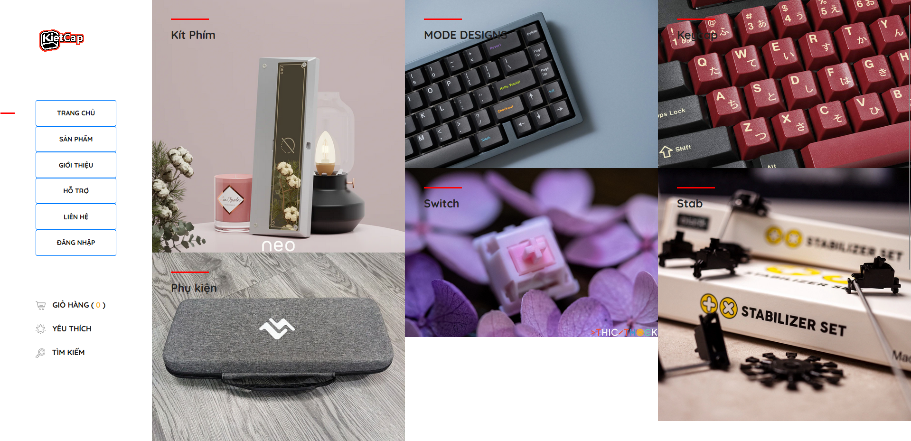
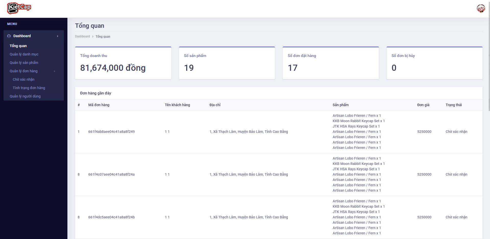
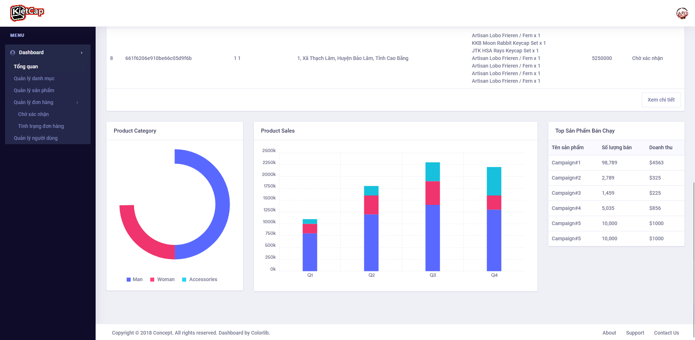
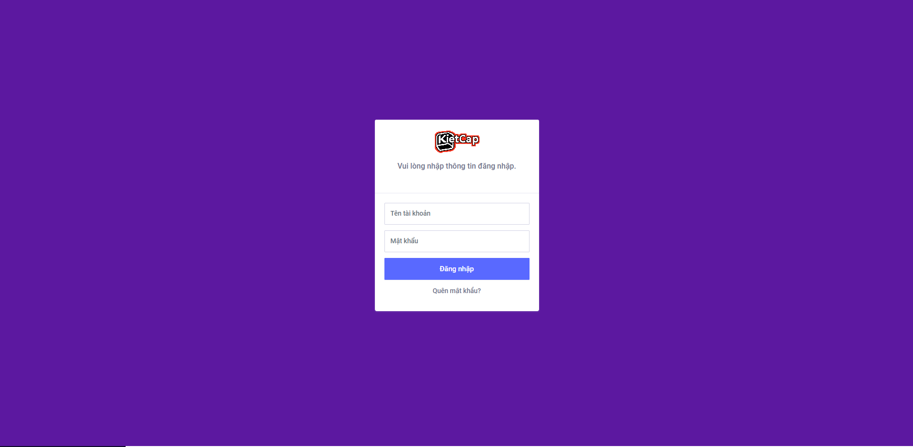

# WebsiteQLBanKeyBoard_ExpressJS

## Cài đặt

1. Xóa thư mục `node_modules`, sau đó mở terminal và chạy lệnh:
   
```
npm i
```

```
npm install express mongoose bcrypt nodemailer jsonwebtoken passport connect-flash express-session
```


## Thiết lập cơ sở dữ liệu

1. Cài đặt MongoDB và MongoDB Compass.

2. Tạo một collection có tên là `ecommerce` trong MongoDB.

3. Nhập các tệp JSON trong file /ecommerce mongodb vào collection `ecommerce`.

## Khởi động ứng dụng

Để khởi động ứng dụng, chạy lệnh sau:

```
npm start
```

## Một số giao diện Website

- Giao diện người dùng
- Giao diện admin
- Giao diện login







